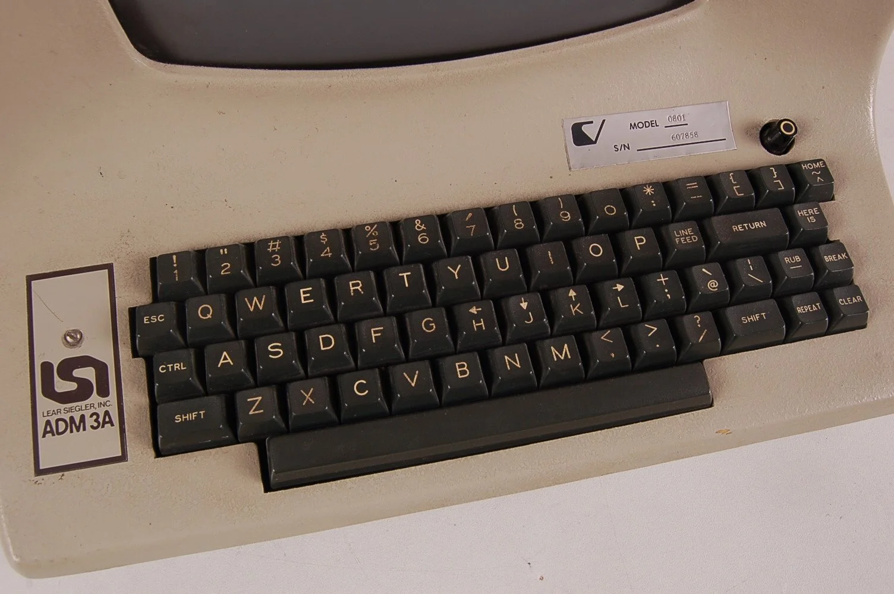

# VIM

> Vim (Vi improved) is a command-line text editor, based off of the Vi editor, first introduced in 1976. Although it's very old, it still remains an important tool for modern developers. Vim is ubiquitous, since it is available on any Mac/Linux system, including any server you would SSH into. Also, vim has changed very little over time, so it's a good choice if you don't want to re-learn how to use a text editor every few years.

> Even if you only need to use an editor on your local machine, Vim is still a very good choice. It can be configured with all kinds of settings and plugins to make it comfortable for you, like any modern text editor. Also, since Vim is so old, it was actually designed before computer mice were commonly used, so Vim can be used fully without the mouse, at all! You can code much faster if you never have to take your hands off the keyboard. 

> If you want a compromise between Vim and other modern text editors, you might not need to choose! Many modern editors support Vim-style keybindings, so you can apply everything you learn in this lesson while still using VSCode, if you like.

> Vim is a `modal editor`, meaning that it has multiple modes it can be in.
- NORMAL mode
- INSERT mode
- COMMAND mode
- VISUAL mode
- REPLACE mode

> Today, we'll mostly be learning about NORMAL mode, INSERT mode, and COMMAND mode. Other modes will be discussed briefly. 

## STARTING IN NORMAL MODE
> When you open Vim initially, you'll be in NORMAL mode. You might think that NORMAL is a strange name for this mode, because it doesn't work like a normal editor! In NORMAL mode, none of they keys you press will insert text into the document, instead they will perform different commands, similar to what you'd find in the `Edit` menu of a normal text editor, like VSCode. The first commands we should learn about are the ones that enter INSERT mode from NORMAL mode. There are 6 of them, but it's really not as much as it sounds like. In Vim, there are many commands that do similar things. Also, most commands in Vim can be slightly modified by holding SHIFT when you press the command. Sometimes, holding SHIFT will perform an action before the cursor, instead of after the cursor. Sometimes, holding SHIFT will perform an action on an entire line, instead of a single character. 
`i` - insert. Enter insert mode before the cursor
`I` - insert. Enter insert mode at the start of the current line
`a` - append. Enter insert mode after the cursor
`A` - append. Enter insert mode at the end of the current line
`o` - open.   Enter insert mode on a new, blank line below the cursor
`O` - open.   Enter insert mode on a new, blank line above the cursor

> All of the above commands are useful, but for now, let's just use `i` to enter INSERT mode.

## INSERT MODE
> INSERT mode is pretty simple. It works like a normal text editor, where you can type letters on your keyboard to insert them into the document. By default, there is only one command in INSERT mode. Press `esc` in INSERT mode to return to NORMAL mode. 
> You might find that this is not a convenient shortcut, since `esc` is pretty far from the home row. When Vim was originally designed, keyboards looked different!

